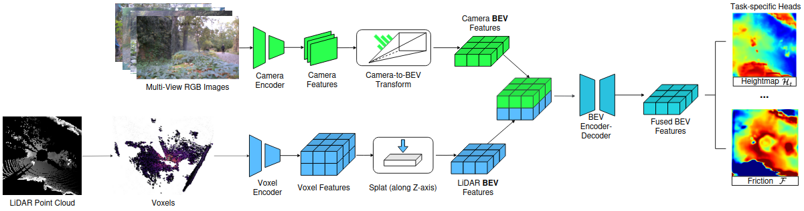
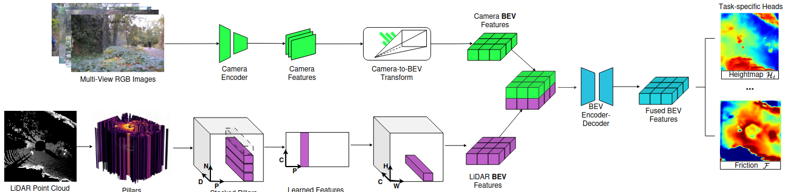
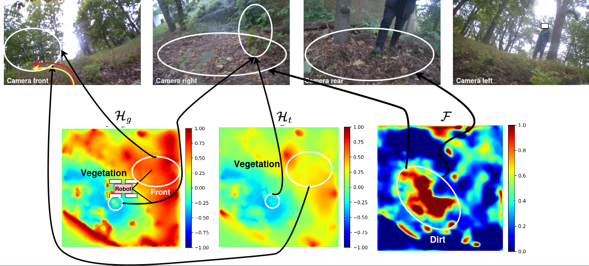

## Acknowledgement

This project is based on the FusionForce framework originally developed by the
CTU-VRAS team:
https://github.com/ctu-vras/fusionforce

The original project is licensed under the BSD-3-Clause license.

Parts of the codebase and description were modified, extended, and newly implemented by the author
for research purposes and academic work.

# Sensor Fusion for Estimation of the Physical Terrain Properties

## Abstract

This thesis addresses the estimation of physical terrain properties for off-road mobile robot navigation using multi-modal perception and physics-informed learning. A Bird’s-Eye View (BEV) fusion architecture is proposed to combine RGB images and LiDAR point clouds, enabling the prediction of terrain geometry and physical interaction properties (friction, stiffness, and damping) that are critical for modeling robot motion.
The predicted terrain properties are evaluated using a differentiable physics engine that simulates robot–terrain interaction. This framework enables self-supervised learning by utilizing trajectory-level errors as a training signal, bypassing the need for direct ground truth of physical terrain properties, which is often unavailable in real-world off-road environments.
Experimental results demonstrate that physics-based supervision significantly improves trajectory prediction accuracy and physical consistency compared to perception-only training. Furthermore, multi-modal fusion increases robustness in challenging environments characterized by sparse visual cues or dense vegetation. Overall, the results show that combining multi-modal perception with physics-informed learning is an effective strategy for achieving terrain-aware off-road navigation.

## Pipeline


- The **FusionForce Predictor** estimates rich features in image and voxel domains.
- Both **camera and lidar features** are vertically projected on the ground plane.
- Multi-headed terrain encoder-decoder is used to predict terrain properties.
- **Neuro Symbolic Physics Engine** estimate forces at robot-terrain contacts.
- Resulting robot trajectory is integrated from these forces.

Learning employs three losses:
- trajectory loss, $L_{\tau}$, which measures the distance between the predicted and real trajectory;
- geometrical loss, $L_{g}$,  which measures the distance between the predicted
geometrical heightmap and lidar-estimated heightmap;
- terrain loss, $L_{t}$, which enforces rigid terrain on rigid semantic classes
revealed through image foundation model [SEEM](https://github.com/UX-Decoder/Segment-Everything-Everywhere-All-At-Once).

### Terrain Encoders with unified BEV fusion




## Installation
The package is organized as a
[ROS 1](https://docs.ros.org/) package and can be installed using the following the
instructions in [fusionforce/docs/INSTALL.md](./fusionforce/docs/INSTALL.md).

## Usage

### Physics Engine

To test the Physics Engine, one can run the following command:

```bash
python fusionforce/scripts/run.py
```
The ROS node can be launched with the following command:

```bash
roslaunch fusionforce physics_engine.launch
```
Topics:
- input: `/terrain/grid_map` - the terrain [GridMap](https://github.com/ANYbotics/grid_map) message with the terrain properties (elevation, friction, etc.).

- output: `/sampled_paths` - the predicted robot trajectories as a [MarkerArray](https://docs.ros.org/en/noetic/api/visualization_msgs/html/msg/MarkerArray.html) message.
- output: `/path_costs` - the costs of the predicted trajectories as a [Float32MultiArray](https://docs.ros.org/en/noetic/api/std_msgs/html/msg/Float32MultiArray.html) message.

Parameters:
- `num_robots`: number of robots (trajectories) to simulate,
- `traj_sim_time`: simulation time for each trajectory in seconds,
- `gridmap_layer`: name of the elevation layer in the GridMap message,
- `max_age`: maximum age of the terrain map in seconds to be processed.

### FusionForce Predictor (Terrain Encoder)

The ROS node for the FusionForce Predictor can be launched with the following command:

```bash
roslaunch fusionforce terrain_encoder.launch terrain_encoder:=<model> img_topics:=[<img_topic1>, .. , <img_topicN>] camera_info_topics:=[<info_topic1>, .. , <info_topicN>] cloud_topic:=<cloud_topic>
```

where `<model>` is one of the available models: `voxelnet`, `lss`, or `bevfusion`.

Topics:
- input: a list of `img_topics` as a [sensor_msgs/CompressedImage](http://docs.ros.org/en/noetic/api/sensor_msgs/html/msg/CompressedImage.html) messages (required for `lss`, and `bevfusion`),
- input: a list of `camera_info_topics` as a [sensor_msgs/CameraInfo](http://docs.ros.org/en/noetic/api/sensor_msgs/html/msg/CameraInfo.html) messages (required for `lss` and `bevfusion`),
- input: `cloud_topic` as a [sensor_msgs/PointCloud2](http://docs.ros.org/en/noetic/api/sensor_msgs/html/msg/PointCloud2.html) message (required for `voxelnet` and `bevfusion`).

- output: `/terrain/grid_map` as a [GridMap](https://github.com/ANYbotics/grid_map) message with the estimated terrain properties.

Parameters:
- `model`: the model to use for the terrain encoder, one of `voxelnet`, `lss`, or `bevfusion`,
- `robot_frame`: the frame of the robot, e.g., `base_link`,
- `fixed_frame`: the fixed frame for the gravity alignment, e.g., `map`,
- `max_msgs_delay`: maximum delay in seconds for the input messages to be processed,
- `max_age`: maximum age of the sensor input in seconds to be processed,

### FusionForce (Terrain Encoder + Physics Engine)

The ROS node for the FusionForce Predictor with the Physics Engine can be launched with the following command:

```bash
roslaunch fusionforce fusionforce.launch terrain_encoder:=<model> img_topics:=[<img_topic1>, .. , <img_topicN>] camera_info_topics:=[<info_topic1>, .. , <info_topicN>] cloud_topic:=<cloud_topic>
```
The module combines the FusionForce Predictor and the Physics Engine into a single node.
It has the same input as the FusionForce Predictor, but also outputs the predicted robot trajectories and their costs,
as the Physics Engine does.



Top row shows synchronized RGB images from the front, right, rear, and left cameras. Bottom row shows the corresponding BEV-aligned predicted terrain maps (geometrical $\mathcal{H}_g$, terrain $\mathcal{H}_t$, and friction $\mathcal{F}$), illustrating inferred supporting terrain structure beneath vegetation and rigid ground regions. The robot trajectory (predicted yellow, ground-truh red) and field of view are overlaid for reference.

## Citation of original paper which this work is build on

Consider citing the paper if you find the work relevant to your research:

```bibtex
@article{agishev2025fusionforce,
  title={FusionForce: End-to-end Differentiable Neural-Symbolic Layer for Trajectory Prediction},
  author={Agishev, Ruslan and Zimmermann, Karel},
  journal={arXiv preprint arXiv:2502.10156},
  year={2025},
  primaryClass={cs.RO},
  url={https://arxiv.org/abs/2502.10156},
}
```
